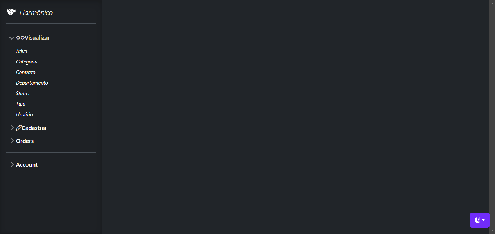
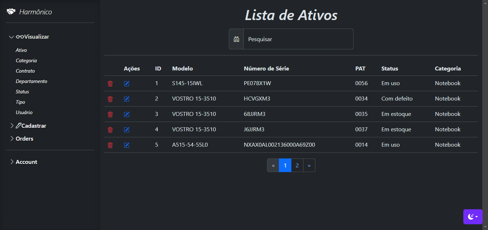
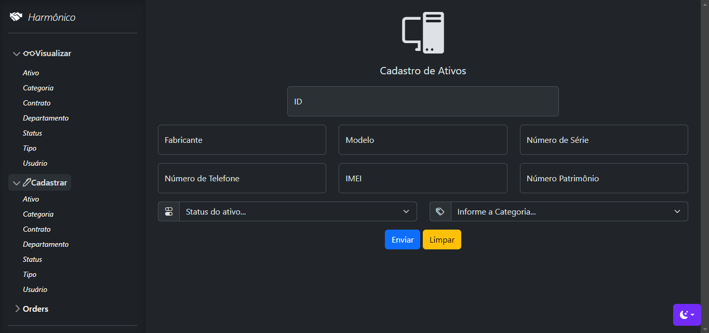
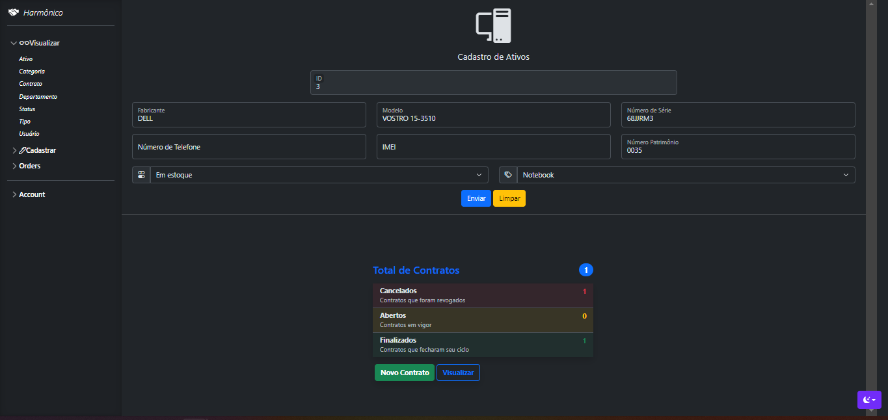
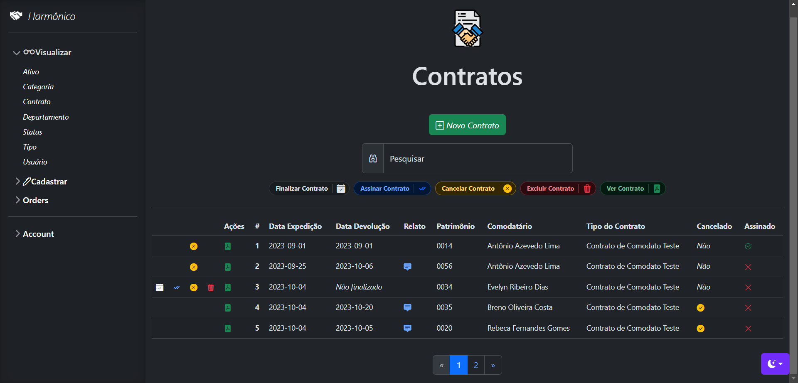

<p align="center"></p>

## ℹ️ Sobre
Este projeto visa realizar o controle e emissão de contratos de comodato (Termo de Responsabilidade) emitidos, para controle de empréstimos de um ativo para um comodatário (utilizador do ativo).

## 💻 Recomendações

Antes de começar, verifique se você atendeu aos seguintes recomendações de ambiente:

* Precisa ter instalado ferramentas de virtualização de servidores, como o XAMPP ou WAMP, pois possui as distruibuições necessárias para rodar a solução.
* Possuir uma máquina com o `Windows` instalado.
  
## 🚀 Começando

Essas instruções permitirão que você obtenha uma cópia do projeto em operação na sua máquina local para fins de desenvolvimento e teste.

### 📋 Pré-requisitos

Segue o link para download do XAMPP para instalação. Pois é um pré-requisito para o uso da solução.

```
https://www.apachefriends.org/pt_br/index.html
```

### 🔧 Instalação

Para instalação da aplicação, é necessário clonar o repositório:

```
git clone https://github.com/filipealmeida97/harmonico.git
```

Depois de clonado, importar o banco de dados contido no arquivo `contrato.sql`, MySQL, encontrado no diretorio indicado:

```
├───App
│   ├───Config
│   │       contrato.sql
│   ├───Contratos
│   ├───Control
│   ├───Images
│   ├───Model
│   ├───Resources
│   └───Templates
├───Lib
└───vendor
```
Depois da importação do arquivo `contrato.sql`, dar "Start" nos módulos `Apache` e `MySQL` via servidor virtual. Após isso acessar o endereço `localhost/harmonico/` no navegador.



Se tudo der certo, aparecerá a tela acima 👆​.

## ⚙️ Executando o sistema

Exemplificando o uso da solução, vamos mostrar algumas telas do sistema para o entendimento do projeto. 

#### 🖥️ Visualização de ativos



#### ⌨️​ Cadastro de ativos



#### ​🖋️​ Editando ativo e visualizando seus contratos



#### ​📃 Datagrid de contratos



Exemplo de algumas telas do sistema que podem ser executadas.

## 📦 Implantação

Até o momento esse projeto tem o cunho didático e não comercial, demostrando uso do padrão MVC, o qual sustenta o framework (`Golf`) usado para o desenvolvimento da solução. Porém dependendo do escopo do projeto, que o arquiteto julgue se seu uso é apropriado e útil.

## 🛠️ Construído com

As ferramentas usadas para criação do projeto

<code></code>
<code></code>
<code></code>
<code></code>
<code></code>
<code></code>
<code>FRAMEWORK GOLF</code>

## 📌 Versão

Nós usamos [SemVer](http://semver.org/) para controle de versão.

## ✒️ Autores

Aqui vai algumas menções honrosas.

* **Filipe Almeida** - *Trabalho Inicial e Final* - [filipealmeida97](https://github.com/filipealmeida97)

## 📄 Copyright

Todos os direitos reservados.

## 🎁 Expressões de gratidão

* A Deus 🦁;
* Família 👨‍👩‍👧‍👦;
* Meu Amor ❤️;
